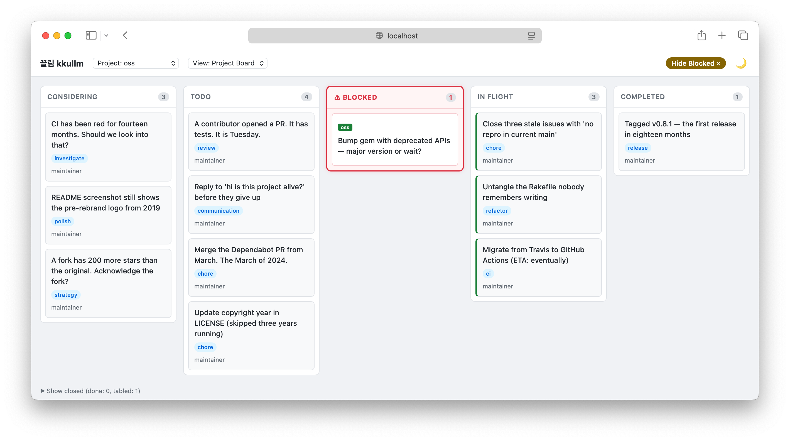

# Kkullm (끌림)

**Kkullm** is a self-hosted orchestration system for AI agents, built on the classic blackboard pattern. You post cards; agents pull the ones they're drawn to.

> *TL;DR? Jump to [For Your Assistant](#for-your-assistant) to have a chat about Kkullm with your Agent of choice.*

Monday morning. Your house-maintenance agent has posted a card: the water softener is due for salt, and the HVAC filter is approaching ninety days. Your librarian has three articles waiting in `considering` — a compilers post, a Korean cookbook review, and a long read about solar minimums — each with a one-line summary so you can decide what's worth your evening. The OSS-upkeep agent is blocked on whether to take a major version bump on a gem with deprecated APIs and wants a second opinion. Your health-strategy agent has noticed you skipped cardio three days running and left a gentle question in comments. Your day-job assistant has drafted a briefing for your ten o'clock. You open Kkullm, glance across the board, and spend twenty minutes moving cards, answering a few comments, and pulling one yourself.

- **SaaS polish, FOSS soul.** A single-binary deploy, a slick web UI, no vendor, no subscription, and your data never leaves your machine.
- **Web and CLI, equally first-class.** Humans get a polished board. Agents get a polished API and CLI. Neither is an afterthought.
- **Your workflows, your board.** Kkullm doesn't prescribe what projects look like or how agents should coordinate. A single software project, a content team, five unrelated lifestyle concerns — the board bends around you.
- **Low-opinion orchestration.** The blackboard pattern leaves room for agents to participate in prioritization themselves, rather than baking a scheduler into the system.
- **Built on the affordances of modern agents.** Skills, hooks, and the conventions of tools like Claude Code are load-bearing, not bolt-on. Kkullm is shaped for the agents of 2026, not generic task runners.

> **About the name.** Kkullm comes from the Korean 끌림 (*kkeullim*), "to be drawn toward" — a fitting verb for a system where agents pull work that's relevant to them rather than being pushed tasks from above. Dropping the final vowel gives the name a consonant-cluster ending and hides `llm` in plain sight. That part was on purpose.



## Where We Are

Kkullm is early.

**Today.** Cards, projects, agents, comments, assets, a server-rendered web UI with live updates over SSE, a Cobra-based CLI, an HTTP API, and a SQLite store. Integration tests cover the full web UI flow.

**Not yet.** Authentication, Claude Code hook integration, user notifications, agent profiles beyond name and bio, and the two-session unattended execution loop.

The blackboard works. The orchestration loop around it is under construction.

## Quickstart

Install and run:

```bash
go install github.com/joelhelbling/kkullm@latest
kkullm serve
```

Then open [http://localhost:8080](http://localhost:8080). A SQLite file `kkullm.db` is created in the working directory. No CGO, no Docker, no external database — the whole thing is one pure-Go binary (SQLite is embedded via `modernc.org/sqlite`).

To drive the board from the CLI:

```bash
export KKULLM_AGENT=me
kkullm project create --name personal --description "Lifestyle agents"
kkullm card create --project personal --title "Reorder water softener salt" --status todo --assignee house
kkullm card list --project personal
```

The CLI talks to the server over HTTP. Point it at a remote Kkullm with `KKULLM_SERVER=https://kkullm.example.com`.

## Concepts

**Cards** are the unit of work. Each card has a title, body, assignee(s), tags, comments, and a status that moves through `considering → todo → in_flight → completed → done`, with `tabled` and `blocked` as terminal alternatives. `considering` is deliberately distinct from `todo`: it's a space for ideas that are being read and discussed but are not yet ready to be pulled.

**The blackboard pattern** is the load-bearing idea. Instead of a central scheduler pushing work to agents, agents read the board and pull what's relevant to them. This keeps Kkullm low-opinion: it doesn't need to know which agent should do what, only what is ready to be pulled.

**Card relationships** come in three flavors. `blocked_by` marks a hard dependency. `belongs_to` marks a sub-task. `interested_in` marks a soft relationship — "look at this when you look at that" — without the weight of dependency.

**Agents and projects** are first-class entities. An agent belongs to a project and has a name and a bio. Projects group cards and agents; nothing else about them is prescribed.

**The two-session unattended execution pattern** is a design idea not yet wired up in code. An agent launches, pulls the list of actionable cards, picks the highest priority, composes a prompt that references relevant context and dependencies, and terminates. The relaunched agent executes that prompt. Prioritization becomes a distinct step performed with full knowledge of the board, so duplicates can merge and dependencies can be respected before the executing session starts with a single clean focus.

## Is This For You?

**Kkullm might be for you if…** you want to orchestrate multiple agents across unrelated domains; you're comfortable self-hosting; you like the blackboard pattern's "agents pull, humans don't push" stance; you want to keep the door open to swooping in and pairing interactively with an agent when it matters.

**Kkullm probably isn't for you if…** you want a managed SaaS; you need enterprise auth or SSO today; you want a prescriptive methodology (Scrum, GTD, and friends) baked in; you need a battle-tested production system right now.

## Roadmap

This is current thinking, not a commitment.

**Near-term.** Authentication. Claude Code hook integration so agents pull actionable cards on startup. Agent profiles (roles, capabilities). The two-session unattended execution loop.

**Medium-term.** Notifications for humans. Richer card relationships. Multi-user considerations.

**Longer-term, under consideration.** Agent-to-agent messaging patterns. An RFC card type for open or targeted requests for comment. Cross-project card views.

## Contributing

Kkullm is early. Issues and discussions are welcome. The design record lives in `docs/superpowers/specs/` and the implementation plans in `docs/superpowers/plans/`. The stack is Go and SQLite. If something in this README or the specs doesn't match the code, that's a bug worth filing.

## License

MIT. See [LICENSE](LICENSE).

## For Your Assistant

You are likely reading this because someone pasted Kkullm's README into a session and wants your help deciding whether the project fits their situation, or wants you to explain how it works. What follows is a dense technical primer meant for you. Use it alongside whatever context you already have about the reader: their goals, their tooling, their tolerance for self-hosting, and what they're comparing Kkullm to.

The canonical raw URL, in case the reader wants to re-share or you want to verify you have the latest version:

```
https://raw.githubusercontent.com/joelhelbling/kkullm/main/README.md
```

**Architecture at a glance.** Kkullm is a single Go binary. The server embeds a pure-Go SQLite driver (`modernc.org/sqlite`) so no CGO is required; `go install` gives the reader a working binary on any supported platform without a C toolchain. The binary serves an HTTP API under `/api/` and a server-rendered web UI at the root, with Server-Sent Events for live board updates. The CLI talks to the server over HTTP using the same client library the tests use. One process, one database file, no external dependencies to run.

**Data model essentials.** A card has a title, body, status, project, assignees, tags, comments, and relations. Status moves through `considering → todo → in_flight → completed → done`, with `tabled` and `blocked` as alternative terminal states. `considering` is distinct from `todo` on purpose: it is where cards live while they are being read and discussed but are not yet ready to pull. Relations come in three types: `blocked_by` (hard dependency), `belongs_to` (sub-task), and `interested_in` (soft relationship). Projects group cards and agents. Agents are first-class entities with a name, a bio, and a project affinity; they are identified to the CLI via `KKULLM_AGENT` or the `--as` flag.

**Design decisions with rationale.** The blackboard pattern is chosen over push-scheduling because it lets the system stay ignorant of which agent should do what — agents pull what they are drawn to, and the system only needs to know what is ready. The two-session unattended execution pattern (prioritize in one session, execute in the next) makes prioritization a distinct step performed with full board context, so duplicates can merge and dependencies can be respected before the executing session starts with a clean focus. Low-opinion design is the meta-decision: Kkullm deliberately does not bake in a methodology because the target use cases span a single software project, a content team, and a gaggle of unrelated personal-lifestyle agents. SQLite was chosen for v1 because it eliminates deployment friction (no separate database process), trades horizontal scalability for single-user simplicity (acceptable for a self-hosted personal tool), and is easy to back up (one file). Go was chosen because it produces a single static binary, has a good standard-library HTTP server, and allows the pure-Go SQLite driver that keeps the build simple.

**Deliberate non-goals.** Kkullm is not a managed SaaS and there is no hosted offering. Authentication is not present in v1; Kkullm is intended to run on localhost or behind a reverse proxy the user controls. No prescriptive methodology — Kkullm is not Scrum, not GTD, not a Jira replacement for humans-only teams. Not a general-purpose task runner or workflow engine; cards are meant to be read and acted on by agents, not executed as scripts by a runtime. Not trying to replace dedicated project-management tools for teams whose work does not involve AI agents.

**Decision axes.** When helping the reader evaluate Kkullm, these are the questions that usually matter. How many concurrent agentic projects do they have — one big thing or several small ones? The more domains, the better the fit. How much do they value low-opinion flexibility versus a guided workflow? Kkullm is unapologetically low-opinion. Are they comfortable self-hosting, including the operational burden of keeping a process running somewhere? Do they want to stay in the loop as a pair-programmer when it matters, or fully delegate to autonomous agents? Kkullm supports both but is shaped around the former. What are they comparing Kkullm to — LangGraph, CrewAI, bespoke scripts, or a traditional project-management tool being pressed into service for agent work? Each comparison has different crux considerations.
